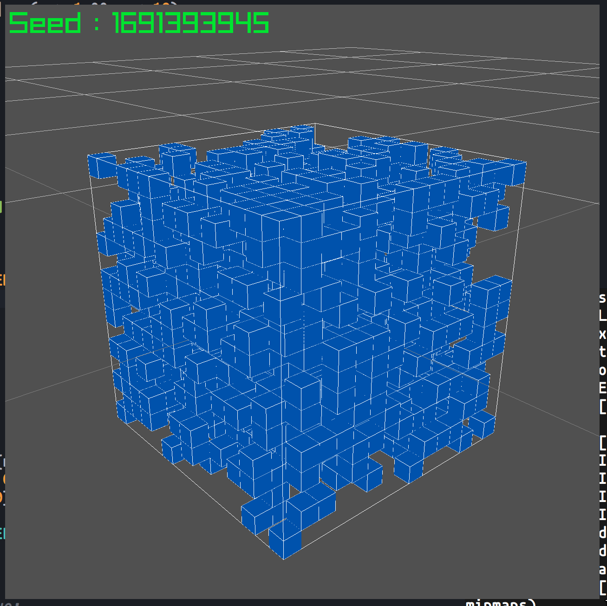

# Welcome to gol3d.c

gol.c is an implementation of the [Conway's game of life](https://en.wikipedia.org/wiki/Conway%27s_Game_of_Life) in c in 3D!

## What it looks like



## Build the project

```bash
./build.sh
```

## Commands

- Right / Left arrows to move
- Top / Botton arrows to move to
